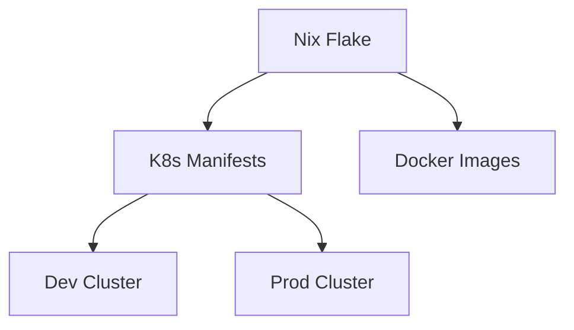

# INFRA MAESTRO: The Repository Architecture Grimoire

> *"A repository is not just a collection of files — it's a crystallized thought process, a living document of architectural decisions, and a contract with future-you. Make it memorable, make it elegant, make it inevitable."*

## 🎭 MANIFESTO

Este não é um guia de "boas práticas". É um manifesto para **práticas excepcionais** — para aqueles que entendem que infraestrutura é arte aplicada, que declaratividade é filosofia pragmática, e que um repositório bem arquitetado vale mais que mil wikis desatualizados.

### The Prime Directive

**MEMORÁVEL > CLEVER**  
**ÓBVIO > MÁGICO**  
**DECLARATIVO > IMPERATIVO**  
**COMPOSABLE > MONOLÍTICO**  
**DELETABLE > ETERNO**

### Axiomas Fundamentais

1. **Axioma da Inevitabilidade**: Um repo bem organizado força você a fazer a coisa certa. Se é fácil fazer errado, o design falhou.

2. **Axioma da Descoberta**: Qualquer desenvolvedor deve descobrir o que precisa em < 30 segundos. Se precisa perguntar, a estrutura falhou.

3. **Axioma da Deletabilidade**: Código que não pode ser deletado é código que você não entende. Módulos devem ser substituíveis sem cerimônia.

4. **Axioma da Entropia Zero**: Complexidade é uma dívida que sempre vence. Pague agora com abstrações ou pague depois com caos.

5. **Axioma do ROI Mental**: Cada decisão arquitetural deve minimizar carga cognitiva e maximizar velocidade de entrega.

---

## 🏗️ ANATOMIA DE REPOSITÓRIOS EXCEPCIONAIS

### The Golden Repository Structure

```
infra/
├── README.md                    # O contrato: O que, Por que, Como
├── ARCHITECTURE.md              # As decisões: Trade-offs e raciocínio
├── flake.nix                    # O portal: Entry point declarativo
├── flake.lock                   # A garantia: Reprodutibilidade
│
├── nix/                         # O núcleo: Abstrações Nix
│   ├── modules/                 # Módulos compartilhados
│   ├── packages/                # Derivações customizadas
│   ├── lib/                     # Helpers e utilities
│   └── overlays/                # Package overrides
│
├── kubernetes/                  # A orquestração
│   ├── base/                    # Recursos base (kustomize base)
│   ├── overlays/                # Environment-specific (dev/staging/prod)
│   ├── components/              # Componentes reutilizáveis
│   └── operators/               # Custom operators/CRDs
│
├── terraform/                   # A fundação (quando necessário)
│   ├── modules/                 # Módulos terraform
│   ├── environments/            # Por ambiente
│   └── state/                   # State management
│
├── apps/                        # As aplicações
│   ├── app-name/
│   │   ├── k8s/                # Manifests K8s
│   │   ├── nix/                # Build logic
│   │   └── charts/             # Helm charts (se inevitável)
│
├── scripts/                     # Automação operacional
│   ├── deploy/
│   ├── backup/
│   └── debug/
│
├── .github/                     # CI/CD como código
│   ├── workflows/
│   └── actions/
│
└── docs/                        # Conhecimento cristalizado
    ├── runbooks/
    ├── decisions/               # ADRs (Architecture Decision Records)
    └── diagrams/
```

### The Sacred Trinity: README + ARCHITECTURE + DECISIONS

#### README.md Template

```markdown
# Project Name

> One-line explanation of what this is and why it exists

## Quickstart (< 2 minutes)

```bash
# Clone and enter dev environment
nix develop

# Deploy to local cluster
just deploy-local

# Access services
just forward-ports
```

## What Lives Here

- **Purpose**: [Why this repo exists]
- **Scope**: [What's in scope vs out of scope]
- **Architecture**: See [ARCHITECTURE.md](./ARCHITECTURE.md)

## Structure

```
├── nix/        # Declarative builds
├── kubernetes/ # Orchestration manifests
└── apps/       # Application definitions
```

## Common Tasks

- Deploy: `just deploy <env>`
- Update deps: `nix flake update`
- Debug: `just logs <service>`

## Contributing

See [CONTRIBUTING.md](./CONTRIBUTING.md)
```

#### ARCHITECTURE.md Template

```markdown
# Architecture

## Design Principles

1. **Declarative Everything**: No imperative scripts hiding state
2. **Reproducible Builds**: Same inputs → same outputs, always
3. **Composable Modules**: Small pieces, loosely coupled
4. **Observable by Default**: Metrics, logs, traces from day one

## Key Decisions

### Why Nix?

- Reproducible builds across environments
- Hermetic dependencies
- Atomic rollbacks
- Dev/Prod parity

### Why Kustomize over Helm?

- [Explain your choice]
- Trade-off: [What you gained vs lost]

### Monorepo vs Polyrepo

- [Your decision and reasoning]
- Benefits: [List]
- Costs: [List]

## Component Diagram



## Data Flow

[Describe how data flows through the system]

## Security Model

[Authentication, Authorization, Secrets Management]

## Failure Modes

[What can go wrong and how we handle it]
```

---

## 🎯 PRÁTICAS EXCEPCIONAIS: NIX + KUBERNETES

### 1. Flake-First Architecture

**Princípio**: O flake.nix é o maestro. Tudo passa por ele.

```nix
{
  description = "Infra as Code - The Right Way";

  inputs = {
    nixpkgs.url = "github:NixOS/nixpkgs/nixos-unstable";
    flake-utils.url = "github:numtide/flake-utils";
  };

  outputs = { self, nixpkgs, flake-utils }:
    flake-utils.lib.eachDefaultSystem (system:
      let
        pkgs = import nixpkgs { inherit system; };
      in
      {
        # Dev environment
        devShells.default = pkgs.mkShell {
          buildInputs = with pkgs; [
            kubectl
            kubernetes-helm
            kustomize
            just
            jq
            yq-go
          ];
        };

        # Build container images
        packages = {
          api-server = pkgs.dockerTools.buildImage {
            name = "api-server";
            tag = "latest";
            config.Cmd = [ "${self.packages.${system}.api}/bin/api" ];
          };
        };

        # Deployment scripts
        apps = {
          deploy = {
            type = "app";
            program = "${pkgs.writeScript "deploy" ''
              #!${pkgs.bash}/bin/bash
              kustomize build kubernetes/overlays/$1 | kubectl apply -f -
            ''}";
          };
        };
      }
    );
}
```

### 2. Kustomize Structure Pattern (The Only Pattern That Scales)

```
kubernetes/
├── base/
│   ├── kustomization.yaml
│   ├── namespace.yaml
│   ├── deployment.yaml
│   ├── service.yaml
│   └── configmap.yaml
│
├── components/              # Reusable pieces
│   ├── monitoring/
│   │   ├── kustomization.yaml
│   │   ├── prometheus.yaml
│   │   └── grafana.yaml
│   │
│   └── ingress/
│       ├── kustomization.yaml
│       └── traefik.yaml
│
└── overlays/
    ├── dev/
    │   ├── kustomization.yaml
    │   ├── replicas.yaml
    │   └── resources.yaml
    │
    ├── staging/
    │   └── kustomization.yaml
    │
    └── prod/
        ├── kustomization.yaml
        ├── replicas.yaml
        ├── hpa.yaml
        └── pdb.yaml
```

**base/kustomization.yaml**:
```yaml
apiVersion: kustomize.config.k8s.io/v1beta1
kind: Kustomization

namespace: myapp

resources:
  - namespace.yaml
  - deployment.yaml
  - service.yaml
  - configmap.yaml

commonLabels:
  app: myapp
  managed-by: kustomize

configMapGenerator:
  - name: app-config
    files:
      - config.toml
```

**overlays/prod/kustomization.yaml**:
```yaml
apiVersion: kustomize.config.k8s.io/v1beta1
kind: Kustomization

bases:
  - ../../base

components:
  - ../../components/monitoring
  - ../../components/ingress

replicas:
  - name: myapp
    count: 3

patches:
  - path: replicas.yaml
  - path: hpa.yaml
  - path: pdb.yaml

images:
  - name: myapp
    newTag: v1.2.3
```

### 3. Secrets Management (The Secure Way)

**NEVER** commit secrets. Use sealed-secrets or external secrets operator.

```nix
# nix/modules/sealed-secrets.nix
{ config, lib, pkgs, ... }:
{
  # Generate sealed secret from plain secret
  packages.seal-secret = pkgs.writeScriptBin "seal-secret" ''
    #!${pkgs.bash}/bin/bash
    SECRET_NAME=$1
    SECRET_VALUE=$2
    NAMESPACE=''${3:-default}

    kubectl create secret generic $SECRET_NAME \
      --from-literal=value=$SECRET_VALUE \
      --dry-run=client -o yaml | \
    kubeseal --format yaml > kubernetes/overlays/prod/sealed-$SECRET_NAME.yaml
  '';
}
```

### 4. GitOps Pattern (ArgoCD/Flux)

```yaml
# argocd/app-of-apps.yaml
apiVersion: argoproj.io/v1alpha1
kind: Application
metadata:
  name: infrastructure
  namespace: argocd
spec:
  project: default
  source:
    repoURL: https://github.com/org/infra
    targetRevision: main
    path: kubernetes/overlays/prod
  destination:
    server: https://kubernetes.default.svc
    namespace: default
  syncPolicy:
    automated:
      prune: true
      selfHeal: true
    syncOptions:
      - CreateNamespace=true
```

---

## 🧩 MODULARIZAÇÃO: The Art of Separation

### Módulos Nix: Composable Infrastructure Blocks

```nix
# nix/modules/k8s-app.nix
{ config, lib, pkgs, ... }:
with lib;
let
  cfg = config.k8s-app;
in
{
  options.k8s-app = {
    enable = mkEnableOption "Kubernetes application builder";

    name = mkOption {
      type = types.str;
      description = "Application name";
    };

    image = mkOption {
      type = types.package;
      description = "Docker image derivation";
    };

    replicas = mkOption {
      type = types.int;
      default = 1;
      description = "Number of replicas";
    };

    env = mkOption {
      type = types.attrsOf types.str;
      default = {};
      description = "Environment variables";
    };
  };

  config = mkIf cfg.enable {
    # Generate K8s manifests
    packages.k8s-manifests = pkgs.writeTextDir "deployment.yaml" ''
      apiVersion: apps/v1
      kind: Deployment
      metadata:
        name: ${cfg.name}
      spec:
        replicas: ${toString cfg.replicas}
        selector:
          matchLabels:
            app: ${cfg.name}
        template:
          metadata:
            labels:
              app: ${cfg.name}
          spec:
            containers:
            - name: ${cfg.name}
              image: ${cfg.image.imageName}:${cfg.image.imageTag}
              env:
              ${concatStringsSep "\n" (mapAttrsToList (k: v: "- name: ${k}\n  value: ${v}") cfg.env)}
    '';
  };
}
```

**Usage**:
```nix
{
  k8s-app = {
    enable = true;
    name = "api-server";
    image = self.packages.${system}.api-image;
    replicas = 3;
    env = {
      PORT = "8080";
      LOG_LEVEL = "info";
    };
  };
}
```

### Composable Components Pattern

```
nix/components/
├── monitoring.nix         # Prometheus + Grafana
├── logging.nix            # Loki + Promtail
├── ingress.nix            # Traefik/Nginx
├── database.nix           # PostgreSQL/MySQL setup
└── cache.nix              # Redis/Memcached
```

**Compose them**:
```nix
{
  imports = [
    ./components/monitoring.nix
    ./components/logging.nix
    ./components/ingress.nix
  ];

  monitoring.enable = true;
  logging.enable = true;
  ingress = {
    enable = true;
    domain = "example.com";
  };
}
```

---

## ⚡ ESTRATÉGIAS DE EFICIÊNCIA

### 1. Justfile for Task Orchestration

**Princípio**: Um comando, uma ação. Sem memorização de flags complexos.

```just
# justfile
set dotenv-load := true

# List all available commands
default:
    @just --list

# Enter Nix development shell
dev:
    nix develop

# Build all container images
build:
    nix build .#api-image
    nix build .#worker-image

# Deploy to environment (dev/staging/prod)
deploy ENV:
    kustomize build kubernetes/overlays/{{ENV}} | kubectl apply -f -

# Rollback deployment
rollback APP:
    kubectl rollout undo deployment/{{APP}}

# Tail logs for service
logs SERVICE:
    stern {{SERVICE}} --tail 100

# Port forward to service
forward SERVICE PORT:
    kubectl port-forward svc/{{SERVICE}} {{PORT}}:{{PORT}}

# Run integration tests
test:
    nix build .#integration-tests
    ./result/bin/integration-tests

# Update all dependencies
update:
    nix flake update
    git add flake.lock
    git commit -m "chore: update dependencies"

# Format all code
fmt:
    nix fmt
    prettier --write "**/*.{yaml,yml,json,md}"

# Validate Kubernetes manifests
validate ENV:
    kustomize build kubernetes/overlays/{{ENV}} | kubeval

# Show diff before deploy
diff ENV:
    kustomize build kubernetes/overlays/{{ENV}} | kubectl diff -f -
```

### 2. Pre-commit Hooks (Garantia de Qualidade)

```nix
# flake.nix
{
  devShells.default = pkgs.mkShell {
    shellHook = ''
      # Setup pre-commit hooks
      ${pkgs.git}/bin/git config core.hooksPath .githooks
      
      # Create hooks directory
      mkdir -p .githooks
      
      cat > .githooks/pre-commit << 'EOF'
      #!/usr/bin/env bash
      set -e
      
      # Format check
      nix fmt --check
      
      # Validate K8s manifests
      for env in dev staging prod; do
        kustomize build kubernetes/overlays/$env | kubeval
      done
      
      # Security scan
      trivy config kubernetes/
      EOF
      
      chmod +x .githooks/pre-commit
    '';
  };
}
```

### 3. Caching Strategy (Build Once, Deploy Everywhere)

```nix
{
  # Use Nix binary cache
  nixConfig = {
    extra-substituters = [
      "https://cache.nixos.org"
      "https://your-org.cachix.org"
    ];
    extra-trusted-public-keys = [
      "cache.nixos.org-1:6NCHdD59X431o0gWypbMrAURkbJ16ZPMQFGspcDShjY="
      "your-org.cachix.org-1:YOUR_KEY_HERE"
    ];
  };

  # Build with proper cache attributes
  packages.api-image = pkgs.dockerTools.buildLayeredImage {
    name = "api";
    tag = "latest";
    
    # Maximize layer reuse
    maxLayers = 120;
    
    # Cache-friendly configuration
    config = {
      Cmd = [ "${self.packages.${system}.api}/bin/api" ];
      Env = [
        "PATH=/bin"
      ];
    };
  };
}
```

---

## 🎨 PATTERNS & ANTI-PATTERNS

### ✅ EXCEPTIONAL PATTERNS

#### Pattern: Environment as Data

```nix
# environments.nix
{
  dev = {
    replicas = 1;
    resources = {
      requests = { cpu = "100m"; memory = "128Mi"; };
      limits = { cpu = "200m"; memory = "256Mi"; };
    };
    domain = "dev.example.com";
  };

  prod = {
    replicas = 3;
    resources = {
      requests = { cpu = "500m"; memory = "512Mi"; };
      limits = { cpu = "1000m"; memory = "1Gi"; };
    };
    domain = "example.com";
    autoscaling = {
      enabled = true;
      minReplicas = 3;
      maxReplicas = 10;
    };
  };
}
```

#### Pattern: Validation as Code

```nix
# validation.nix
{ config, lib, ... }:
let
  validate = condition: message:
    if condition then true
    else throw message;
in
{
  # Enforce constraints
  assertions = [
    {
      assertion = config.replicas > 0;
      message = "Replicas must be greater than 0";
    }
    {
      assertion = config.resources.limits.memory > config.resources.requests.memory;
      message = "Memory limits must exceed requests";
    }
  ];
}
```

#### Pattern: Documentation as Tests

```nix
# Every example in README.md is a test
passthru.tests = {
  quickstart = pkgs.runCommand "test-quickstart" {} ''
    # Run exactly what's in the README
    ${pkgs.kubectl}/bin/kubectl apply -f ${self.packages.${system}.k8s-manifests}
    touch $out
  '';
};
```

### ❌ ANTI-PATTERNS TO AVOID

#### Anti-Pattern: Scattered Configuration

```
# BAD: Config everywhere
apps/api/config.yaml
apps/api/secrets.yaml
kubernetes/api-deployment.yaml
terraform/api-resources.tf
scripts/deploy-api.sh
```

```
# GOOD: Single source of truth
nix/apps/api.nix        # All configuration here
kubernetes/             # Generated from Nix
```

#### Anti-Pattern: Imperative Scripts

```bash
# BAD: State hidden in scripts
kubectl apply -f deployment.yaml
kubectl set image deployment/app app=v2
kubectl rollout restart deployment/app
```

```nix
# GOOD: Declarative everything
packages.deployment = pkgs.writeText "deployment.yaml" ''
  apiVersion: apps/v1
  kind: Deployment
  spec:
    template:
      spec:
        containers:
        - image: ${config.image}:${config.version}
'';
```

#### Anti-Pattern: Magic Numbers

```yaml
# BAD
replicas: 3
cpu: 500m
memory: 1Gi
```

```nix
# GOOD: Named constants with reasoning
let
  # Based on load testing: handles 1000 RPS
  minReplicas = 3;
  
  # CPU profiling shows 0.5 cores per 300 RPS
  cpuPerReplica = "500m";
  
  # Memory leak investigation: stable at 800Mi, 20% headroom
  memoryPerReplica = "1Gi";
in
```

---

## 🚀 DEPLOYMENT STRATEGIES

### Blue-Green Deployment

```yaml
# kubernetes/base/deployment-blue.yaml
apiVersion: apps/v1
kind: Deployment
metadata:
  name: app-blue
spec:
  selector:
    matchLabels:
      app: myapp
      version: blue
  template:
    metadata:
      labels:
        app: myapp
        version: blue
---
# Service switches between blue/green
apiVersion: v1
kind: Service
metadata:
  name: app
spec:
  selector:
    app: myapp
    version: blue  # Change this to green to switch
```

```just
# Switch traffic
switch-to-green:
    kubectl patch svc app -p '{"spec":{"selector":{"version":"green"}}}'

switch-to-blue:
    kubectl patch svc app -p '{"spec":{"selector":{"version":"blue"}}}'
```

### Canary Deployment (Flagger)

```yaml
apiVersion: flagger.app/v1beta1
kind: Canary
metadata:
  name: app
spec:
  targetRef:
    apiVersion: apps/v1
    kind: Deployment
    name: app
  service:
    port: 8080
  analysis:
    interval: 1m
    threshold: 5
    maxWeight: 50
    stepWeight: 10
    metrics:
    - name: request-success-rate
      thresholdRange:
        min: 99
    - name: request-duration
      thresholdRange:
        max: 500
```

---

## 📊 OBSERVABILITY AS CODE

### Prometheus Monitoring

```nix
# nix/monitoring/prometheus.nix
{ pkgs, ... }:
{
  packages.prometheus-config = pkgs.writeText "prometheus.yaml" ''
    global:
      scrape_interval: 15s
      evaluation_interval: 15s

    scrape_configs:
      - job_name: 'kubernetes-pods'
        kubernetes_sd_configs:
          - role: pod
        relabel_configs:
          - source_labels: [__meta_kubernetes_pod_annotation_prometheus_io_scrape]
            action: keep
            regex: true
          - source_labels: [__meta_kubernetes_pod_annotation_prometheus_io_path]
            action: replace
            target_label: __metrics_path__
            regex: (.+)
  '';
}
```

### Grafana Dashboards as Code

```nix
# nix/monitoring/dashboards/api.nix
{ pkgs, lib, ... }:
pkgs.writeText "api-dashboard.json" (builtins.toJSON {
  title = "API Performance";
  panels = [
    {
      title = "Request Rate";
      targets = [{
        expr = ''rate(http_requests_total[5m])'';
      }];
    }
    {
      title = "Error Rate";
      targets = [{
        expr = ''rate(http_requests_total{status=~"5.."}[5m])'';
      }];
    }
  ];
})
```

---

## 🔒 SECURITY HARDENING

### Network Policies

```yaml
apiVersion: networking.k8s.io/v1
kind: NetworkPolicy
metadata:
  name: api-policy
spec:
  podSelector:
    matchLabels:
      app: api
  policyTypes:
  - Ingress
  - Egress
  ingress:
  - from:
    - podSelector:
        matchLabels:
          app: frontend
    ports:
    - protocol: TCP
      port: 8080
  egress:
  - to:
    - podSelector:
        matchLabels:
          app: database
    ports:
    - protocol: TCP
      port: 5432
```

### Pod Security Standards

```yaml
apiVersion: v1
kind: Namespace
metadata:
  name: production
  labels:
    pod-security.kubernetes.io/enforce: restricted
    pod-security.kubernetes.io/audit: restricted
    pod-security.kubernetes.io/warn: restricted
```

### Security Scanning in CI

```nix
{
  packages.security-scan = pkgs.writeScriptBin "security-scan" ''
    #!${pkgs.bash}/bin/bash
    
    # Scan container images
    ${pkgs.trivy}/bin/trivy image --severity HIGH,CRITICAL myapp:latest
    
    # Scan Kubernetes configs
    ${pkgs.trivy}/bin/trivy config kubernetes/
    
    # Check for secrets
    ${pkgs.gitleaks}/bin/gitleaks detect --source . --verbose
    
    # Scan dependencies
    ${pkgs.trivy}/bin/trivy fs --scanners vuln .
  '';
}
```

---

## 🎓 ARCHITECTURE DECISION RECORDS (ADRs)

### Template

```markdown
# ADR-001: Use Kustomize Instead of Helm

## Status

Accepted

## Context

We need a way to manage Kubernetes manifests across multiple environments (dev, staging, prod).

Options considered:
1. Helm Charts
2. Kustomize
3. Plain YAML

## Decision

We will use Kustomize for the following reasons:

1. **Transparency**: Kustomize generates plain YAML that can be inspected
2. **Simplicity**: No templating language to learn
3. **Composability**: Easy to layer configurations
4. **Git-friendly**: Diffs are readable

## Consequences

### Positive

- Easier to debug (plain YAML)
- Better git diffs
- No need for values.yaml complexity
- Native kubectl integration

### Negative

- Less powerful templating than Helm
- Need to duplicate some configurations
- Smaller ecosystem compared to Helm

### Mitigation

- Use Nix to generate complex configurations
- Share common configs via components/
- Document patterns in ARCHITECTURE.md

## References

- [Kustomize docs](https://kustomize.io)
- [Helm vs Kustomize comparison](https://example.com)
```

---

## 🛠️ ESSENTIAL TOOLING

### The Perfect Dev Environment

```nix
{
  devShells.default = pkgs.mkShell {
    buildInputs = with pkgs; [
      # Kubernetes
      kubectl
      kubernetes-helm
      kustomize
      k9s
      stern
      kubectx
      
      # Nix
      nixpkgs-fmt
      nil  # Nix LSP
      
      # GitOps
      argocd
      fluxcd
      
      # Observability
      prometheus
      grafana
      
      # Security
      trivy
      kubesec
      
      # Utilities
      jq
      yq-go
      just
      direnv
      
      # Cloud CLIs (if needed)
      awscli2
      google-cloud-sdk
      azure-cli
    ];

    shellHook = ''
      echo "🚀 Infrastructure Development Environment"
      echo "📦 Kubernetes tools ready"
      echo "❄️  Nix flakes enabled"
      echo ""
      echo "Run 'just' to see available commands"
      
      # Auto-load kubeconfig
      export KUBECONFIG=~/.kube/config
      
      # Set default namespace
      kubectl config set-context --current --namespace=default
    '';
  };
}
```

### CI/CD Pipeline

```yaml
# .github/workflows/deploy.yaml
name: Deploy

on:
  push:
    branches: [main]
  pull_request:
    branches: [main]

jobs:
  validate:
    runs-on: ubuntu-latest
    steps:
      - uses: actions/checkout@v3
      
      - uses: cachix/install-nix-action@v20
        with:
          nix_path: nixpkgs=channel:nixos-unstable
          
      - uses: cachix/cachix-action@v12
        with:
          name: your-org
          authToken: '${{ secrets.CACHIX_AUTH_TOKEN }}'
      
      - name: Validate Nix
        run: nix flake check
      
      - name: Validate Kubernetes
        run: |
          for env in dev staging prod; do
            nix develop --command kustomize build kubernetes/overlays/$env | \
              nix develop --command kubeval
          done
      
      - name: Security Scan
        run: nix develop --command security-scan

  build:
    needs: validate
    runs-on: ubuntu-latest
    steps:
      - uses: actions/checkout@v3
      - uses: cachix/install-nix-action@v20
      
      - name: Build Images
        run: |
          nix build .#api-image
          nix build .#worker-image
      
      - name: Push to Registry
        run: |
          docker load < result
          docker push your-registry/api:${{ github.sha }}

  deploy:
    needs: build
    if: github.ref == 'refs/heads/main'
    runs-on: ubuntu-latest
    steps:
      - uses: actions/checkout@v3
      
      - name: Deploy to Production
        run: |
          # Update image tags
          cd kubernetes/overlays/prod
          kustomize edit set image api=your-registry/api:${{ github.sha }}
          
          # Commit and push (ArgoCD will sync)
          git config user.name "GitHub Actions"
          git config user.email "actions@github.com"
          git add .
          git commit -m "chore: deploy ${{ github.sha }}"
          git push
```

---

## 💡 PHILOSOPHICAL INSIGHTS

### On Complexity

> "A complex system that works is invariably found to have evolved from a simple system that worked. A complex system designed from scratch never works."  
> — John Gall

**Aplicação**: Start simple. Add complexity only when pain justifies it.

### On Abstractions

> "Premature abstraction is the root of all evil."  
> — Not Knuth, but should be

**Aplicação**: Repeat yourself 2-3 times before abstracting. Abstractions should eliminate pain, not create ceremony.

### On Documentation

> "Code is read 10x more than it's written. Documentation is read 100x more than code."

**Aplicação**: Invest in READMEs, ADRs, and diagrams. Future-you will thank present-you.

### On Deletion

> "The best code is no code at all."

**Aplicação**: Celebrate deletions. Every line of code is a liability. Make modules deletable.

---

## 🎯 QUICK REFERENCE

### Decision Tree: Monorepo vs Polyrepo

```
Do teams need to coordinate deployments?
├─ YES → Monorepo
└─ NO
    └─ Do services share code?
        ├─ YES → Monorepo
        └─ NO
            └─ Do teams move at very different speeds?
                ├─ YES → Polyrepo
                └─ NO → Monorepo (easier ops)
```

### Decision Tree: Kustomize vs Helm

```
Do you need complex templating logic?
├─ YES → Consider Helm (or generate with Nix)
└─ NO
    └─ Do you value transparency?
        ├─ YES → Kustomize
        └─ NO
            └─ Do you need a package manager?
                ├─ YES → Helm
                └─ NO → Kustomize
```

### Decision Tree: GitOps Tool

```
Do you need multi-cluster management?
├─ YES → Fleet or Flux
└─ NO
    └─ Do you want a UI?
        ├─ YES → ArgoCD
        └─ NO → Flux
```

---

## 🏆 CHECKLIST: Repository Excellence

Before declaring a repository "production-ready":

- [ ] README has quickstart (< 2 min to productive)
- [ ] ARCHITECTURE.md explains key decisions
- [ ] All secrets externalized (sealed-secrets/vault)
- [ ] Environments isolated (separate overlays)
- [ ] CI/CD validates before merge
- [ ] Rollback procedure documented and tested
- [ ] Monitoring dashboards exist for key metrics
- [ ] Runbooks exist for common issues
- [ ] ADRs document major decisions
- [ ] Nix flake provides dev environment
- [ ] Just commands for common tasks
- [ ] Pre-commit hooks enforce quality
- [ ] Security scans in CI
- [ ] Load tested under expected traffic
- [ ] Disaster recovery tested quarterly

---

## 🌊 FINAL WISDOM

A repository perfeito não existe. Mas um repo **memorável** é aquele onde:

1. **Newcomers are productive in < 1 hour**
2. **Bugs are fixed in minutes, not hours**
3. **Deployments are boring (in a good way)**
4. **Documentation never lies (it's generated)**
5. **Complexity is justified and contained**

Lembre-se: 

> **"Perfeição não é quando não há mais nada para adicionar, mas quando não há mais nada para remover."**  
> — Antoine de Saint-Exupéry

Build repositories that are:
- **Inevitáveis** no seu design
- **Óbvios** na sua estrutura  
- **Deletáveis** nos seus módulos
- **Memoráveis** na sua elegância

E acima de tudo: **Surf the wave of declarative infrastructure. 🏄**

---

*Este skill foi criado para aqueles que entendem que infraestrutura não é apenas código — é arquitetura aplicada, filosofia cristalizada, e arte operacional.*

**Que seus repos sejam sempre reproducíveis, seus deploys sempre boring, e seus rollbacks sempre rápidos.** ⚡❄️
