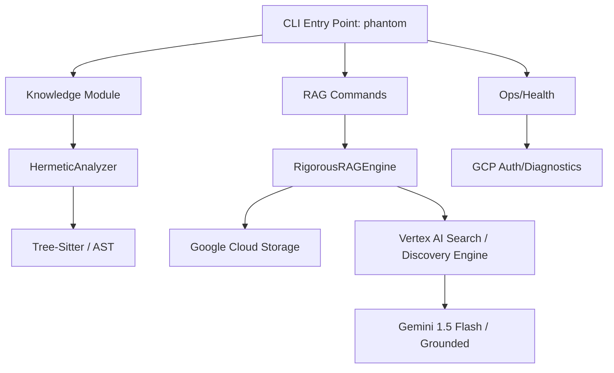

# 🧠 CEREBRO (Phoenix) - Architecture & Investigation Report

> **Date**: Thursday, January 8, 2026
> **Project**: Phoenix Cloud Run (phantom-cli)
> **Author**: Gemini CLI Agent

## 📋 Executive Summary
PHANTOM is a modular, high-performance framework designed for deep code analysis and Retrieval-Augmented Generation (RAG). It bridges the gap between static code analysis (AST/Tree-Sitter) and Large Language Models (LLMs) by extracting structured artifacts from repositories and indexing them into a local vector database. The system is built for reliability, featuring robust error handling for cloud APIs, comprehensive health checks, and a flexible hook system for CI/CD integration.

---

## 📊 Stats
*   **Total Python Files**: ~25 files
*   **Total Lines of Code**: 3,153 (Core Logic)
*   **Major Categories**:
    *   **Core**: Extraction, RAG Engine, GCP Integration, Security Analyzer.
    *   **Modules**: Knowledge Management, Credit/Billing Auditing, NixOS Skills.
    *   **CLI**: Unified interface via Typer/Rich.

---

## 📂 Category Breakdown

| Category | Description | Primary Modules |
| :--- | :--- | :--- |
| **Core (RAG)** | Vector DB management and grounded generation. | `rag/engine.py`, `rag/server.py` |
| **Core (Extraction)** | AST and Tree-Sitter based code parsing. | `extraction/analyze_code.py` |
| **Core (GCP)** | Integration with Vertex AI, BigQuery, and Auth. | `gcp/auth.py`, `gcp/search.py` |
| **Modules (Intelligence)** | Domain-specific logic and "skills". | `knowledge/`, `nixos/`, `credit_burner/` |
| **CLI & Ops** | Interface and system health diagnostics. | `cli.py`, `ops/health` |

---

## 🔗 Dependency Graph (Simplified)



---

## 📦 Module Analysis

### 1. `src/phantom/core/rag/engine.py`
*   **Purpose**: Manages the RAG lifecycle (Ingestion -> Retrieval -> Generation).
*   **Key Tech**: `google-cloud-discoveryengine`, `google-cloud-storage`.
*   **Complexity**: 🟡 Medium
*   **Highlights**: 
    *   **Cloud-Native Ingestion**: Uploads artifacts to GCS and triggers Discovery Engine import (Consumes Credits).
    *   **Grounded Generation**: Uses Gemini via Search API to ensure credit eligibility.
    *   **Anti-429**: Avoids local embedding computation to bypass resource exhaustion limits.

### 2. `src/phantom/core/extraction/analyze_code.py`
*   **Purpose**: Deep repository scanning and artifact extraction.
*   **Key Tech**: `ast` (Python), `tree-sitter` (Polyglot).
*   **Complexity**: 🟡 Medium
*   **Highlights**:
    *   `HermeticAnalyzer` implements pre/post analysis hooks.
    *   Heuristic engine for security (hardcoded keys) and performance.
    *   Dependency mapping across `requirements.txt`, `pyproject.toml`, etc.

### 3. `src/phantom/cli.py`
*   **Purpose**: Command-line orchestration.
*   **Key Tech**: `typer`, `rich`.
*   **Complexity**: 🟢 Low
*   **Highlights**: Supports `knowledge analyze`, `rag query`, and `ops health` with high-quality visual output.

---

## 🔒 Security & Data Privacy Review
*   **Secret Management**: Uses `google.auth` and `python-dotenv`. Credentials are not hardcoded but rely on the environment.
*   **Vulnerability Detection**: The `HermeticAnalyzer` contains built-in patterns to detect hardcoded secrets and unsafe `exec/eval` calls in the *target* repositories being analyzed.
*   **Data Privacy**: RAG data is stored locally in `./data/vector_db` (Chroma), ensuring that while embeddings are computed in the cloud, the searchable index remains on-disk.

---

## 🏗️ Architecture Patterns
*   **Modular Monolith**: Logic is cleanly separated into `core` (infrastructure) and `modules` (features).
*   **Adapter Pattern**: Vertex AI and ChromaDB are wrapped in engine classes to allow for future backend swaps.
*   **Command Pattern**: CLI commands map directly to core engine methods, ensuring a thin UI layer.

---

## 🔌 MCP Integration Strategy (Proposed)
The project is perfectly positioned to serve as an **MCP (Model Context Protocol) Server**.

### Current Status
*   `poetry.lock` already includes `mcp` library references.
*   Documentation in `agents/nix-expert/` mentions MCP integration.

### Implementation Plan
1.  **Expose Tools**: Convert `HermeticAnalyzer.analyze_repo` and `RigorousRAGEngine.query_with_metrics` into MCP Tools.
2.  **Resource Mapping**: Map the `./data/analyzed` directory as MCP Resources for external LLMs to read.
3.  **Data Flow**:
    ```text
    External LLM (Claude) -> MCP Server (Phantom) -> RAG Engine -> ChromaDB -> Context -> Response
    ```
4.  **Performance**: Use MCP's session-based management to keep the Vector DB in memory during multi-turn chats.

---

## ⚠️ Technical Debt & Recommendations

1.  **RAG Caching**: Currently, every `rag ingest` re-processes files. Implement a hash-based cache (e.g., using `artifacts.json`) to only embed modified files.
2.  **Concurrency**: Ingestion is synchronous. Moving to `asyncio` for Vertex AI calls could significantly reduce ingestion time.
3.  **Refined Metadata**: Enhance the RAG metadata to include Git commit hashes for better provenance.
4.  **Security Hardening**: Implement input sanitization for `repo_path` in the CLI to prevent directory traversal attacks if the CLI is ever exposed as a service.

---

## 🚀 Recommended Next Steps
1.  **Deploy MCP Bridge**: Create `src/phantom/core/mcp_server.py` to expose Phantom's intelligence to the system-wide MCP server.
2.  **Batch Optimization**: Tune the Vertex AI batch size (currently 20) based on real-world latency/quota data.
3.  **Integration Test Suite**: Expand `tests/integration/test_workflow.py` to cover the full `analyze -> ingest -> query` loop.

---
*Report generated by Phoenix Intelligence Engine.*
