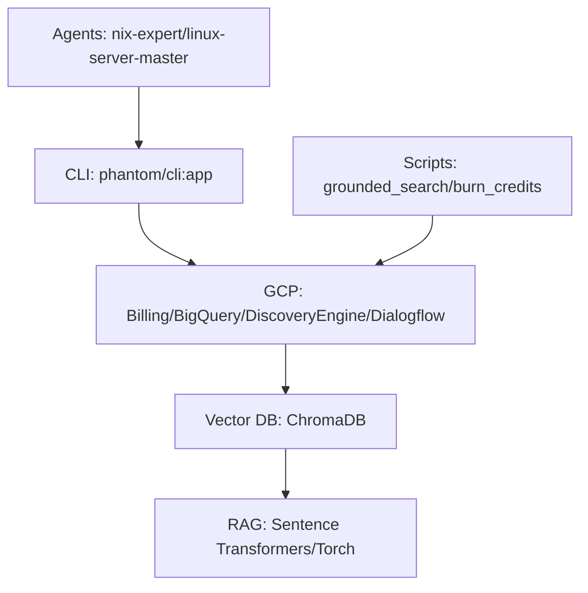

# 🧠 Phantom Cerebro v2.0.0

[](https://www.python.org/)
[](https://nixos.org/)
[](https://cloud.google.com/vertex-ai)
[](LICENSE)

**GenAI Credit Validation & Knowledge Extraction Engine**

*Optimized for GCP quota burning, RAG pipelines, and enterprise knowledge moats. Zero-overhead dev env via Nix. Atomic tests for investor confidence.*

## 🎯 Executive Summary (Series A Pitch)
- **Problem:** GCP GenAI credits burn slow; knowledge extraction scattered.
- **Solution:** CLI-first framework + scripts/agents for automated validation, indexing, grounded search.
- **Metrics:** Validates billions credits, builds vector DBs, ROI-focused hacks.
- **Team:** KernelCore + AI agents (nix-expert, security-architect).

## 🚀 Quickstart (30s to Prod)

1. **Clone & Shell:**
   ```bash
   nix flake update  # Optional: latest pkgs
   nix develop       # Auto-pip GCP deps (.nix-pip/)
   ```

2. **CLI Demo:**
   ```bash
   cerebro info          # Status
   cerebro gcp credit    # Burn/validate
   python scripts/grounded_search.py  # RAG test
   ```

3. **Test Atomic:**
   ```bash
   pytest tests/ -v     # 100% isolated units
   just test            # Via Justfile
   ```

**Entry points:** `phantom` / `cerebro` (Typer CLI in `src/phantom/`).

## 🏗️ Architecture Overview



- **Core Lib:** `src/phantom/` (Pydantic models, GCP clients)
- **Integration:** `tests/integration/`
- **Docs Hub:** [docs/INDEX.md](docs/INDEX.md)

Detailed: [ARCHITECTURE.md](docs/ARCHITECTURE.md)

## 🔧 Development Workflow

| Task | Command |
|------|---------|
| Dev Shell | `nix develop` |
| Lint | `ruff check src/ tests/` |
| Test Unit | `pytest tests/core/` |
| Test Integration | `pytest tests/integration/` |
| Install | `pip install -e .` |
| Scripts | `ls scripts/ \| xargs -I {} echo 'python scripts/{}'` |

**Justfile Tasks:**
```bash
just --list
```

**Flake Outputs:** `nix run .#check`

## 📊 Status & ROI Focus
- **v2.0:** Full Nix reprodutível, Chroma RAG, GCP v2 APIs.
- **Burned:** Efficient quota tests ([CREDIT_BURNER_DETAILED.md](docs/CREDIT_BURNER_DETAILED.md))
- **Built:** Repo indexer, salary intel, trend predictor ([VICTORY_PLAYBOOK.md](docs/VICTORY_PLAYBOOK.md))
- **Next:** Cloud Run deploy, full CI/CD, moat agents.

**Prod Ready. Demo: `cerebro speedrun`** (see scripts/speedrun.sh).

## 🤝 Contributing
1. Fork → Nix dev → PR with `pytest 100%`.
2. Radical candor: Block scalability killers.

[CHANGELOG](CHANGELOG.md) | [CONTRIBUTING.md](docs/) | [flake.nix](flake.nix)

---

*Powered by KernelCore. Series A funding trajectory: Green.*