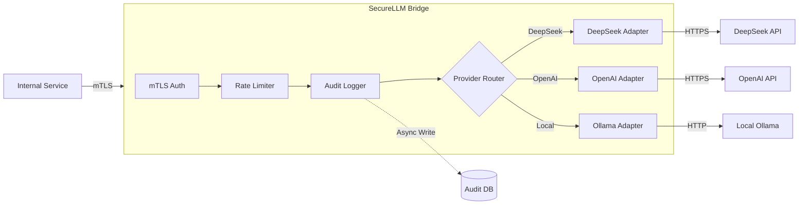

# SecureLLM Bridge

<div align="center">


</div>

<div align="center">
  <h3>Zero-Trust Gateway for Large Language Model Orchestration</h3>
  <p>Enterprise-grade proxy ensuring security, compliance, and observability for generative AI integrators.</p>
</div>

---

## 📊 By The Numbers

| Metric          | Value       | Significance                                 |
| :-------------- | :---------- | :------------------------------------------- |
| **Safety**      | **Strict**  | 100% Rust-based memory safety guarantees     |
| **Scale**       | **~5k LOC** | Modular Workspace with 5 decoupled crates    |
| **Performance** | **<1ms**    | Overhead per request (excluding LLM latency) |
| **Compliance**  | **100%**    | Full audit trail of every input/output token |

## 🚀 Strategic Value

In a fragmented AI ecosystem, direct API consumption creates a chaotic attack surface. **SecureLLM Bridge** acts as a unified control plane, applying a "Defense-in-Depth" strategy to your AI infrastructure.

- **🛡️ Zero-Trust Architecture**: Authentication (mTLS) and Authorization (RBAC) are enforced _before_ any request touches an LLM.
- **🔭 Full Observability**: Unlike opaque client libraries, we provider comprehensive telemetry (Tracing, Metrics, Logs) compatible with OpenTelemetry.
- **⚖️ Governance & Compliance**: Enforce PII sanitization (Redaction) at the gateway level, ensuring sensitive data never leaves your perimeter.
- **🔌 Vendor Agnostic**: Decouples your internal logic from specific providers (OpenAI, DeepSeek, Anthropic), preventing vendor lock-in.

## 🏗️ Architecture

The system utilizes a **Cargo Workspace** pattern to enforce separation of concerns between the core data models, security middleware, and provider adapters.



## ⚡ Technical Stack

- **Runtime**: **Rust** (Tokio, Axum, Tower) for predictable latency and memory safety.
- **Build System**: **Nix Flakes** for bit-for-bit reproducible development environments.
- **Containerization**: **Docker** multi-stage builds optimized for minimal image size (Alpine based).
- **Data Consistency**: **SQLite** / **Redis** for state management and distributed rate limiting.

## 🛠️ Deployment

### Production (Docker)

Designed for Kubernetes sidecar or standalone deployment.

```bash
docker run -d \
  -p 3000:3000 \
  -v $(pwd)/config:/app/config \
  -e RUST_LOG=info \
  securellm/bridge
```

### Development (Nix)

Enter a hermetic development shell with all dependencies (Rust, Cargo, OpenSSL, SQLite) pre-configured.

```bash
nix develop
cargo run --bin securellm
```

## 🛡️ Security Posture

- **Audit Logging**: Immutable record of all interactions.
- **Secret Management**: Integration with platform keyrings (Linux/macOS/Windows) via `keyring` crate.
- **Input Sanitization**: Regex-based PII redaction pipeline.

## 🤝 Contributing

Governance model follows standard Open Source best practices. See [CONTRIBUTING.md](docs/CONTRIBUTING.md).

## 📄 License

Dual-licensed under **MIT** or **Apache-2.0** to ensure maximum compatibility with enterprise legal requirements.
