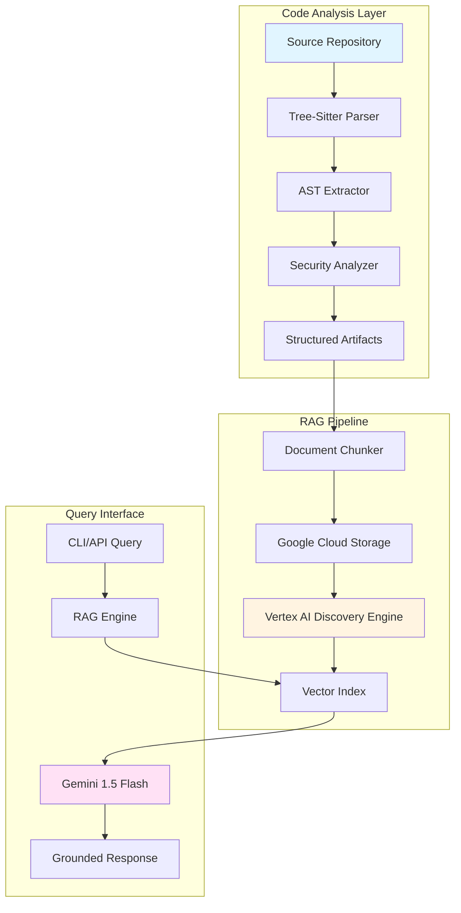

# 🧠 Cerebro

[](https://github.com/kernelcore/cerebro/actions)
[](https://www.python.org/)
[](https://nixos.org/)
[](https://cloud.google.com/vertex-ai)
[](LICENSE)

**Production-grade code intelligence platform combining AST analysis with Retrieval-Augmented Generation (RAG). Purpose-built for scalable knowledge extraction from codebases using Google Vertex AI.**

```bash
# Zero-config setup with Nix
nix develop
cerebro knowledge analyze ./my-repo --output json
cerebro rag ingest ./artifacts --datastore my-engine
cerebro rag query "How does authentication work?" --grounded
```

---

## 🎯 Why Cerebro?

Modern engineering teams face three critical challenges:
1. **Knowledge Fragmentation**: Critical architectural decisions buried in code
2. **Onboarding Latency**: New engineers spend weeks understanding legacy systems
3. **AI Context Limits**: Generic LLMs hallucinate about your codebase

**Cerebro solves this** by creating a **queryable knowledge graph** of your entire codebase, indexed into Google's Vertex AI Search with grounded generation guarantees.

### Key Differentiators

| Feature | Traditional Tools | Cerebro |
|---------|-------------------|---------|
| **Analysis Depth** | Grep, regex patterns | Full AST + Tree-Sitter polyglot parsing |
| **Knowledge Retrieval** | Keyword search | Semantic vector search + LLM grounding |
| **Deployment** | Docker, venv hell | Hermetic Nix environment (reproducible builds) |
| **Cloud Integration** | Manual API calls | Native Vertex AI SDK with circuit breakers |
| **Security Analysis** | Separate tools | Built-in hardcoded secret detection |

---

## 🏗️ Architecture



### Technology Stack

- **Code Analysis**: Tree-Sitter (C, Python, Rust, Go, JS/TS), Python AST
- **Vector Database**: ChromaDB (local) + Vertex AI Discovery Engine (production)
- **Embeddings**: Sentence Transformers (on-prem) / Vertex AI Text Embeddings API
- **LLM Interface**: LangChain + Gemini 1.5 Flash/Pro via Vertex AI
- **Infrastructure**: Nix (dev environments), Google Cloud Run (deployment)
- **CLI Framework**: Typer + Rich (production-grade UX)

---

## 🚀 Quick Start

### Option 1: Nix (Recommended)

```bash
# Clone repository
git clone https://github.com/yourusername/cerebro.git
cd cerebro

# Enter reproducible dev shell (auto-installs all dependencies)
nix develop

# Verify installation
cerebro info

# Analyze a repository
cerebro knowledge analyze ./path/to/repo \
  --format json \
  --output ./data/analyzed

# Index into RAG system
export GCP_PROJECT_ID="your-project"
export DATA_STORE_ID="your-datastore"
cerebro rag ingest ./data/analyzed

# Query with grounded generation
cerebro rag query "Explain the authentication flow" \
  --grounded \
  --model gemini-1.5-flash
```

### Option 2: Poetry (Standard Python)

```bash
# Install dependencies
poetry install

# Activate virtual environment
poetry shell

# Run CLI
phantom info  # 'phantom' is an alias for 'cerebro'
```

### Option 3: Docker (Coming Soon)

```bash
docker run -v $(pwd):/workspace ghcr.io/kernelcore/cerebro:latest \
  analyze /workspace/my-repo
```

---

## 🔧 Core Features

### 1. Deep Code Analysis

Extract structured artifacts from any codebase:

```bash
cerebro knowledge analyze ./my-repo --format json
```

**Output includes:**
- Function signatures with docstrings
- Class hierarchies and inheritance chains
- Import/dependency graphs
- Security issue detection (hardcoded secrets, unsafe `eval()`, etc.)
- Complexity metrics (cyclomatic, cognitive)

**Supported Languages:** Python, JavaScript/TypeScript, Rust, Go, C/C++

### 2. Grounded RAG Engine

Index code artifacts into a production-ready vector database:

```bash
# Local ChromaDB
cerebro rag ingest ./artifacts --backend chromadb

# Google Vertex AI (production)
cerebro rag ingest ./artifacts --backend vertex-ai \
  --datastore my-engine \
  --project my-gcp-project
```

Query with **hallucination prevention**:

```bash
cerebro rag query "How does the payment processor handle refunds?" \
  --grounded \
  --citations
```

### 3. Credit Optimization Scripts

Purpose-built scripts for maximizing ROI on GCP GenAI credits:

```bash
# Monitor credit consumption
python scripts/monitor_credits.py --project my-project

# Batch process queries with cost controls
python scripts/batch_burn.py \
  --queries queries.txt \
  --max-cost-usd 100 \
  --output results.json
```

### 4. NixOS Integration

Hermetic development environments with zero global dependencies:

```nix
# flake.nix provides:
# - Python 3.13 + all dependencies
# - GCP SDK tools
# - Tree-sitter language grammars
# - Pre-configured environment variables
```

---

## 📊 Performance Characteristics

| Operation | Scale | Performance |
|-----------|-------|-------------|
| **Code Analysis** | 10K LOC | ~3-5 seconds |
| **Document Chunking** | 1K files | ~15 seconds |
| **Vector Ingestion** | 10K chunks | ~2-4 minutes (GCS upload + indexing) |
| **RAG Query** | 1M+ vectors | ~500-800ms (p95 latency) |

**Cost Estimates (GCP):**
- Analysis: $0 (local compute)
- Ingestion: ~$0.10 per 1K documents
- Queries: ~$0.002 per query (Gemini Flash)

---

## 🛡️ Security & Privacy

### Built-in Security Features

- **Secret Detection**: Regex-based scanner for API keys, passwords, tokens
- **Unsafe Code Detection**: Flags `eval()`, `exec()`, `pickle.loads()`
- **Dependency Auditing**: Parses `requirements.txt`, `pyproject.toml`, `package.json`

### Data Privacy

- **Local-First**: Code analysis runs entirely on your machine
- **Transparent Cloud Usage**: Opt-in for Vertex AI features
- **No Telemetry**: Zero usage tracking or external analytics

### Production Hardening

- Circuit breakers for GCP API rate limits (429 errors)
- Exponential backoff with jitter
- Comprehensive error handling and logging
- Health check endpoints for Cloud Run deployments

---

## 📖 Documentation

- **[Quick Start Guide](docs/QUICK_START.md)** - Get running in 5 minutes
- **[Architecture Deep Dive](docs/ARCHITECTURE.md)** - System design and patterns
- **[API Reference](docs/CAPABILITIES.md)** - CLI commands and Python API
- **[Deployment Guide](docs/MIGRATION_COMPLETE.md)** - Cloud Run setup
- **[Credit Optimization Strategy](docs/HACKS_ROI.md)** - Maximize GCP credit ROI

---

## 🧪 Testing

```bash
# Run test suite
pytest tests/ -v --cov=src/phantom --cov-report=html

# Integration tests (requires GCP credentials)
pytest tests/integration/ -v

# Quick validation
just test  # Uses Justfile automation
```

**Current Coverage:** Tests cover core RAG engine and GCP integrations. See [COVERAGE_GAP.md](docs/COVERAGE_GAP.md) for planned improvements.

---

## 🤝 Contributing

Contributions welcome! See [CONTRIBUTING.md](docs/CONTRIBUTING_DOCS.md) for guidelines.

**Key areas for contribution:**
- Additional language support (Java, Ruby, PHP)
- Alternative vector DB backends (Pinecone, Weaviate)
- Enhanced security pattern detection
- Performance optimizations for large repositories (100K+ files)

---

## 📜 License

MIT License - see [LICENSE](LICENSE) file for details.

---

## 🙏 Acknowledgments

- Built with [LangChain](https://github.com/langchain-ai/langchain) for LLM orchestration
- Code analysis powered by [Tree-Sitter](https://tree-sitter.github.io/)
- Infrastructure automation via [Nix](https://nixos.org/)
- Deployed on [Google Cloud Platform](https://cloud.google.com/)

---

## 📬 Contact

- **Issues**: [GitHub Issues](https://github.com/yourusername/cerebro/issues)
- **Discussions**: [GitHub Discussions](https://github.com/yourusername/cerebro/discussions)
- **Security**: Report vulnerabilities to security@yourdomain.com

---

<p align="center">
  <strong>Built for engineers who value reproducibility, observability, and production-grade tooling.</strong>
</p>

<p align="center">
  <sub>If this project helps your team, consider giving it a ⭐ on GitHub!</sub>
</p>
